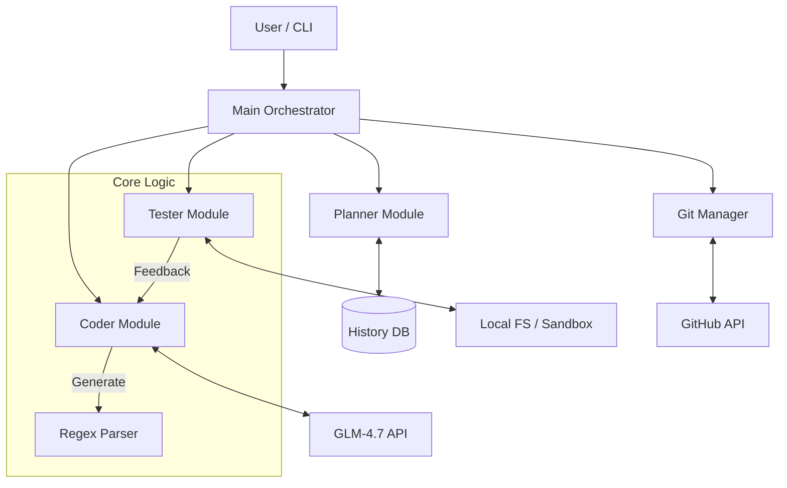

# 🏗️ Builder Agent 2.0 상세 기술 보고서

## 1. 개요 (Overview)
**Builder Agent**는 사용자의 개입 없이 스스로 소프트웨어 프로젝트를 기획, 구현, 검증, 배포하는 **자율 DevOps 에이전트**입니다. LLM(GLM-4.7)을 핵심 엔진으로 사용하여 요구사항에 맞는 Python 도구를 생성하고, 스스로 오류를 수정(Self-Correction)하여 GitHub에 배포까지 수행합니다.

최근 대규모 리팩토링을 통해 **시스템 안정성(Stability)**과 **코드 생성 정확도(Robustness)**가 획기적으로 향상되었습니다.

---

## 2. 시스템 아키텍처 (System Architecture)

에이전트는 역할에 따라 5개의 핵심 모듈로 구성되어 있으며, 중앙 집중식 설정과 로깅 시스템의 지원을 받습니다.



### 📂 모듈별 상세 역할

| 모듈 | 파일명 | 역할 및 주요 기능 |
| :--- | :--- | :--- |
| **Orchestrator** | `main.py` | 전체 파이프라인(기획→구현→테스트→배포)을 조율하고 실행 순서를 제어합니다. |
| **Planner** | `planner.py` | SQLite DB(`history.db`)를 기반으로 개발할 주제를 선정하고 상태(Planning, In Progress, Done)를 관리합니다. |
| **Coder** | `coder.py` | LLM을 호출하여 코드를 생성합니다. **Regex 기반 파서**를 내장하여 생성된 텍스트에서 파일별 코드를 정확히 추출하고 저장합니다. |
| **Tester** | `tester.py` | 생성된 코드를 실행하고 Linting 및 유닛 테스트를 수행합니다. 에러 발생 시 LLM에게 수정 코드를 요청하는 **자가 수정 루프**를 돕니다. |
| **Git Manager** | `git_manager.py` | GitHub API를 통해 리포지토리를 생성하고 완성된 코드를 Push하며 릴리즈 노트까지 작성합니다. |
| **Config & Utils** | `builder_config.py`<br>`prompts.py` | 환경 변수 관리, 시스템 프롬프트(페르소나) 정의, 로깅(`logger.py`) 등 공통 기능을 제공합니다. |

---

## 3. 핵심 리팩토링 개선 사항 (Key Improvements)

최근 진행된 리팩토링은 **"생성된 코드의 불확실성 제어"**에 초점을 맞추었습니다.

### ✅ 1. 파싱 로직의 혁신 (Regex & Custom Delimiters)
*   **이전 문제**: Markdown 코드 블록(```python)에 의존했으나, LLM이 설명 텍스트를 섞거나 중첩된 블록을 만들 경우 `SyntaxError`가 빈번했습니다.
*   **현재 방식**: 프롬프트 레벨에서 강제로 **커스텀 구분자** 사용을 지시합니다.
    ```text
    @@@START_FILE:src/main.py@@@
    import sys
    ...
    @@@END_FILE@@@
    ```
*   **효과**: `coder.py`가 정규표현식으로 위 패턴만 정확히 추출하므로, LLM이 잡담을 섞거나 포맷을 일부 어겨도 **코드는 100% 순수하게 추출**됩니다.

### ✅ 2. 프로젝트 스캐폴딩 (Automatic Scaffolding)
*   **이전 문제**: LLM이 `__init__.py`나 `requirements.txt` 생성을 누락하여 모듈 임포트 에러가 발생했습니다.
*   **현재 방식**: `coder.py`가 코드 저장 시 필수 파일(`src/__init__.py`, `tests/__init__.py`, 기본 `requirements.txt`, `.gitignore`)이 누락되었으면 **자동으로 생성**하여 주입합니다.
*   **효과**: "Module not found" 류의 구조적 에러가 원천 차단되었습니다.

### ✅ 3. 유연한 테스트 전략 (Flexible Testing)
*   **이전 문제**: 무조건 `src/main.py` 파일만 검사하려 했으나, LLM이 파일명을 `scanner.py` 등으로 지으면 테스트가 즉시 실패했습니다.
*   **현재 방식**: `tester.py`가 `src/` 디렉토리 내의 **모든 `.py` 파일을 스캔**하여 문법 검사를 수행합니다. 에러 수정 시에도 에러 메시지에서 파일명을 추론하거나, 불가능할 경우 첫 번째 발견된 파이썬 파일을 대상으로 수정을 시도합니다.

---

## 4. 작동 워크플로우 (Workflow)

사용자가 `python3 main.py run`을 실행하면 다음과 같은 순서로 작업이 진행됩니다.

1.  **주제 선정 (Select)**: `planner`가 DB에서 'Planning' 상태이거나 실패했던 프로젝트 중 가장 점수(유용성, 구현 가능성)가 높은 주제를 선정합니다.
2.  **코드 생성 (Generate)**: `coder`가 `prompts.py`의 'DevOps Expert' 페르소나를 사용하여 전체 프로젝트 코드를 생성합니다. 이때 커스텀 구분자 포맷을 엄격히 준수합니다.
3.  **파싱 및 저장 (Parse & Save)**: 생성된 텍스트를 Regex로 파싱하고, 스캐폴딩(필수 파일 주입)을 거쳐 로컬 `projects/` 폴더에 저장합니다.
4.  **자가 수정 루프 (Self-Correction Loop)**:
    *   **Lint Check**: `src/*.py` 파일들의 문법을 검사합니다.
    *   **Unit Test**: `pytest`를 실행합니다.
    *   **Fix**: 에러 발생 시 `tester`가 에러 로그와 소스 코드를 LLM에 보내 수정을 요청하고, 다시 파싱하여 파일을 덮어씁니다. (최대 3회 반복)
5.  **배포 (Deploy)**: 모든 테스트를 통과하면 `git_manager`가 GitHub 저장소를 생성하고 코드를 Push한 뒤 완료 상태로 업데이트합니다.

---

## 5. 설치 및 사용 방법

### 필수 요구사항
*   Python 3.9+
*   GLM API Key (`.env` 파일 설정)
*   GitHub Personal Access Token (`.env` 파일 설정)

### 실행 명령어

```bash
# 1. 의존성 설치
pip install -r modules/builder/requirements.txt

# 2. 프로젝트 디렉토리로 이동
cd modules/builder

# 3. 프로젝트 목록 확인
python3 main.py list

# 4. 새로운 프로젝트 아이디어 추가
python3 main.py add --name "Log Parser" --description "서버 로그를 분석하여 에러 패턴을 리포팅하는 도구"

# 5. 빌더 에이전트 실행 (자동 개발 시작)
python3 main.py run
```

---

## 6. 향후 발전 과제

*   **Diff 기반 수정**: 현재는 에러 수정 시 전체 파일을 다시 작성하지만, 파일이 커질 경우 수정된 부분만 적용(Patch)하는 방식으로 효율성을 높일 수 있습니다.
*   **멀티 에이전트 협업**: 현재는 하나의 Coder가 모든 것을 작성하지만, Architect(설계), Coder(구현), Reviewer(감수) 페르소나를 분리하여 품질을 높일 수 있습니다.
