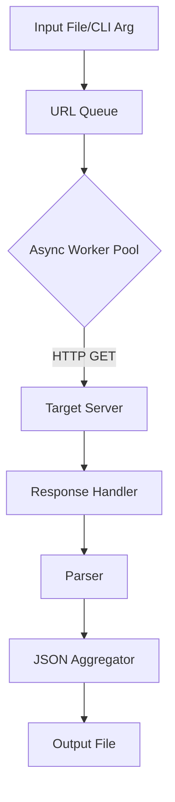

# robots.txt scaner

다량을 url을 수집하고 robots.txt scan 후 json 형식으로 결과 출력

# Technical Specification: Robots.txt Scanner

## 1. Project Overview

**Project Name:** robots.txt Scanner
**Version:** 1.0.0
**Description:** A high-performance command-line tool designed to collect large volumes of URLs, fetch their corresponding `robots.txt` files, parse the directives (Allow, Disallow, Sitemaps, etc.), and output the aggregated results in a structured JSON format.

**Key Objectives:**
*   **Batch Processing:** Capable of processing thousands of URLs efficiently using asynchronous I/O.
*   **Structured Output:** Provides clean, parsable JSON data for integration with other security or SEO tools.
*   **Resilience:** Handles network errors, timeouts, and invalid URLs gracefully without crashing.

## 2. User Stories / Requirements

### Functional Requirements
1.  **URL Input:**
    *   As a user, I want to provide a list of URLs via a text file (one URL per line).
    *   As a user, I want to pass a single URL directly via the command line argument.
2.  **Fetching & Parsing:**
    *   The system shall perform an HTTP GET request to `{URL}/robots.txt`.
    *   The system must parse the raw text of `robots.txt` into distinct fields (User-agent, Disallow, Allow, Crawl-delay, Sitemap).
    *   The system must handle various character encodings (UTF-8, ASCII, Latin-1).
3.  **Output:**
    *   As a user, I want the results saved to a specified JSON file.
    *   The JSON structure must include the requested URL, the status code of the request, and the parsed directives.

### Non-Functional Requirements
1.  **Performance:** The scanner must use asynchronous concurrency to handle large lists (e.g., 100+ concurrent requests) to minimize execution time.
2.  **User-Agent:** The tool should identify itself with a specific User-Agent string (configurable).
3.  **Timeouts:** Requests must time out after a configurable period (default: 10 seconds) to prevent hanging.

## 3. Architecture & Tech Stack

### Tech Stack
*   **Language:** Python 3.9+
*   **HTTP Client:** `aiohttp` (for asynchronous HTTP requests)
*   **Concurrency:** `asyncio`
*   **CLI Framework:** `argparse` (standard library) or `click`
*   **URL Parsing:** `urllib.parse`

### High-Level Architecture
The application follows a **Producer-Consumer** pattern managed by an Async Event Loop.

1.  **Input Reader:** Reads the text file and queues URLs.
2.  **Async Worker Pool:** A set of coroutines that dequeue URLs and fetch data.
3.  **Parser:** Parses the text response from `robots.txt`.
4.  **Aggregator:** Collects results into a list.
5.  **Exporter:** Writes the final list to a JSON file.



## 4. API Design / CLI Commands

### CLI Interface

**Command:**
```bash
python main.py scan [OPTIONS]
```

**Arguments:**

| Argument | Short | Type | Required | Description |
| :--- | :--- | :--- | :--- | :--- |
| `--input` | `-i` | String (Path) | Yes (unless `-u` used) | Path to the text file containing target URLs. |
| `--url` | `-u` | String | No | Single target URL to scan. |
| `--output` | `-o` | String | No | Path to save the output JSON. Default: `results.json`. |
| `--workers` | `-w` | Integer | No | Number of concurrent workers. Default: `50`. |
| `--timeout` | `-t` | Integer | No | Request timeout in seconds. Default: `10`. |

**Usage Examples:**

1.  **Scan a list of URLs:**
    ```bash
    python main.py scan -i targets.txt -o report.json
    ```
2.  **Scan a single URL with high concurrency:**
    ```bash
    python main.py scan -u https://example.com -w 100
    ```

## 5. Data Model / JSON Output Schema

This section defines the structure of the `results.json` file.

**Root Object:**
```json
{
  "meta": {
    "scan_date": "2023-10-27T14:30:00Z",
    "total_urls_scanned": 100,
    "successful": 95,
    "failed": 5
  },
  "results": [
    { ... }
  ]
}
```

**Result Item Object:**
```json
{
  "target_url": "https://example.com",
  "robots_url": "https://example.com/robots.txt",
  "status_code": 200,
  "content_length": 1234,
  "directives": {
    "sitemaps": [
      "https://example.com/sitemap.xml"
    ],
    "user_agents": {
      "*": {
        "disallow": ["/admin/", "/login"],
        "allow": ["/public/"],
        "crawl_delay": null
      },
      "Googlebot": {
        "disallow": ["/private/"],
        "allow": [],
        "crawl_delay": 1
      }
    }
  },
  "raw_content": "User-agent: *\nDisallow: /admin/"
}
```

*Note: If the `robots.txt` file does not exist (404), `status_code` will be 404 and `directives` will be null.*

## 6. Directory Structure

```text
robots-txt-scanner/
├── README.md
├── requirements.txt       # Dependencies: aiohttp
├── setup.py               # Packaging configuration
├── main.py                # Entry point for CLI
├── src/
│   ├── __init__.py
│   ├── core/
│   │   ├── __init__.py
│   │   ├── fetcher.py     # Handles async HTTP requests
│   │   ├── parser.py      # Logic to parse robots.txt text
│   │   └── utils.py       # URL validation helpers
│   └── cli/
│       ├── __init__.py
│       └── commands.py    # Argparse/Cli logic
├── tests/
│   ├── __init__.py
│   ├── test_fetcher.py
│   └── test_parser.py
└── output/                # Default directory for generated JSON files
    └── .gitkeep
```

## 설치

```bash
pip install -r requirements.txt
```

## 사용법

```bash
python -m src.main --help
```

## 라이선스

AGPL-3.0
